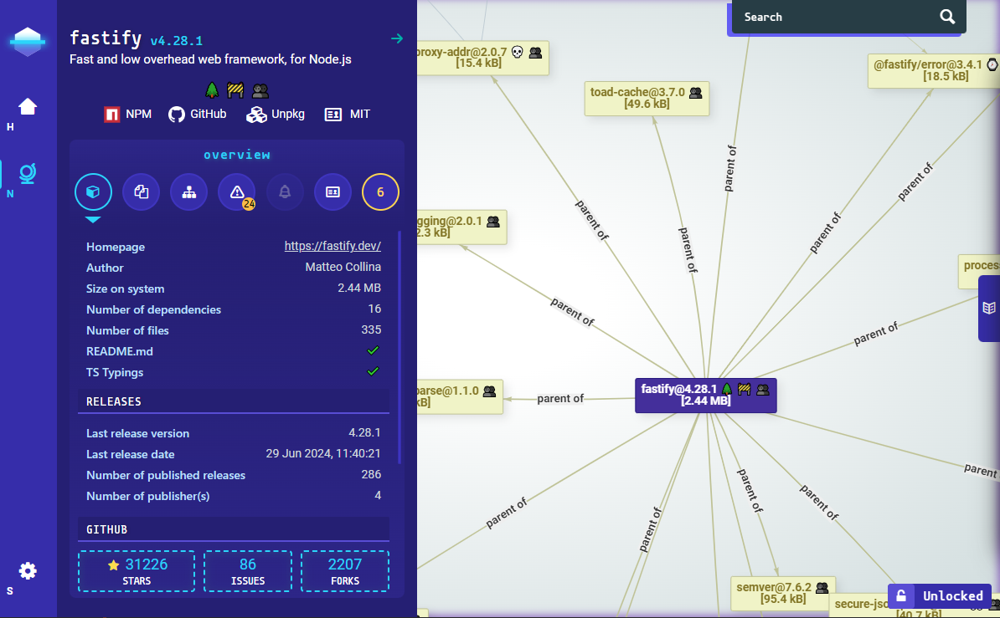

<p align="center"><h1 align="center">
  🐢 Node-Secure CLI 🚀
</h1>

<p align="center">
  a Node.js CLI to deeply analyze the dependency tree of a given NPM package or Node.js local app
</p>

<p align="center">
    <a href="https://www.npmjs.com/package/@nodesecure/cli">
      
    </a>
    <a href="https://github.com/NodeSecure/cli/blob/master/LICENSE">
      
    </a>
    <a href="https://api.securityscorecards.dev/projects/github.com/NodeSecure/cli">
      
    </a>
    <a href="https://slsa.dev/spec/v1.0/levels#build-l3">
      
    </a>
    <a href="https://github.com/NodeSecure/cli/actions?query=workflow%3A%22Node.js+CI%22">
      
    </a>
    <a href="https://codecov.io/github/NodeSecure/cli">
      
    </a>
</p>

<p align="center">

</p>

## 📜 Features

- Run a static scan on every JavaScript files and sort out warnings (unsafe-regex, unsafe-import etc) and the complete list of required expr and statements (files, node.js module, etc.).
- Return complete composition for each packages (extensions, files, tarball size, etc).
- Packages metadata from the npm registry API (number of releases, last publish date, maintainers etc).
- Search for licenses files in the tarball and return the [SPDX](https://spdx.org/licenses/) expression conformance of each detected licenses.
- Link vulnerabilities from the multiple sources like GitHub Advisory, Sonatype or Snyk using [Vulnera](https://github.com/NodeSecure/vulnera). 
- Add flags (emojis) to each packages versions to identify well known patterns and potential security threats easily.
- First-class support of open source security initiatives like [OpenSSF Scorecard](https://github.com/ossf/scorecard).
- Generate security report (PDF).

## 🚧 Requirements

- [Node.js](https://nodejs.org/en/) v20 or higher

## 💃 Getting Started

```bash
$ npm install @nodesecure/cli -g
```

or

```bash
$ git clone https://github.com/NodeSecure/cli.git
$ cd cli

$ npm install
# bundle/compile front-end assets
$ npm run build
$ npm link
```

Then the **nsecure** binary will be available in your terminal. Give a try with the popular [express](http://expressjs.com/) package. This will automatically open the webpage in your default system browser.
```bash
$ nsecure auto express
```

> [!TIP]
> Setup an [npm token](https://github.com/NodeSecure/cli#private-packages--registry) to avoid hiting the maximum request limit of the npm registry API.

## 👀 Usage example

```bash
# Run a scan on the current working dir
# Note: must have a package.json or node_modules directory
$ nsecure cwd

# Run a scan on a remote 'npm' package
$ nsecure from mocha
```

Then a `nsecure-result.json` will be writted at the current CLI location. To open it on a web page just run

```bash
$ nsecure open
```

### Command Documentation

The CLI includes built-in documentation accessible with the --help option:
```bash
$ nsecure --help
$ nsecure <command> --help
```

For complete details on each command, refer to the following documents:

- [`cwd`](./docs/cli/cwd.md)
- [`from`](./docs/cli/from.md)
- [`auto`](./docs/cli/auto.md)
- [`open`](./docs/cli/open.md)
- [`verify`](./docs/cli/verify.md)
- [`summary`](./docs/cli/summary.md)
- [`scorecard`](./docs/cli/scorecard.md)
- [`report`](./docs/cli/report.md)
- [`lang`](./docs/cli/lang.md)
- [`config create`](./docs/cli/config.md)
- [`config`](./docs/cli/config.md)
- [`cache`](./docs/cli/cache.md)

Each link provides access to the full documentation for the command, including additional details, options, and usage examples.

## Private registry / Verdaccio

NodeSecure allow you to fetch stats on private npm packages by setting up a `NODE_SECURE_TOKEN` env variable (which must contains an [npm token](https://docs.npmjs.com/creating-and-viewing-authentication-tokens)).

> [!TIP]
> If you `npm link` the package by yourself you can create a `.env` file at the root of the project too.

NodeSecure is capable to work behind a custom private npm registry too by searching the default registry URL in your local npm configuration.

```bash
$ npm config get registry
$ npm config set "http://your-registry/"
```

## API
Our back-end scanner package is available [here](https://github.com/NodeSecure/scanner).

## Flags legends

Flags and emojis legends are documented [here](https://github.com/NodeSecure/flags/blob/main/FLAGS.md).

## Searchbar filters

Since version **0.6.0**, the UI includes a brand new search bar that allows you to search anything within the tree (graph) using multiple criteria (filters). The currently available filters are:

- package (**the default filter if there is none**).
- version (take a semver range as an argument).
- flag (list of available flags in the current payload/tree).
- license (list of available licenses in the current payload/tree).
- author (author name/email/url).
- ext (list of available file extensions in the current payload/tree).
- builtin (available Node.js core module name).
- size (see [here](https://github.com/NodeSecure/size-satisfies#usage-example)).

Exemple of query:

```
version: >=1.2 | 2, ext: .js, builtin: fs
```

## FAQ

### Why some nodes are red in the UI ?
Nodes are highlighted in red when the project/package is flagged with 🔬 `hasMinifiedCode` or ⚠️ `hasWarnings`. You can deactivate specific warnings in the options if desired.

### Why the package size is so different from Bundlephobia ?
The back-end scanner will analyze the complete size of the npm tarball without any filters or specific optimizations. In contrast, Bundlephobia will bundle the package and remove most of the unnecessary files from the tarball, such as documentation and other non-essential items.

### Why some packages don't have OSSF Scorecard ?
See [Scorecard Public Data](https://github.com/ossf/scorecard#public-data):

> [!NOTE]
> We run a weekly Scorecard scan of the 1 million most critical open source projects judged by their direct dependencies and publish the results in a BigQuery public dataset.

## Contributors guide

If you are a developer **looking to contribute** to the project, you must first read the [CONTRIBUTING](./CONTRIBUTING.md) guide.

If you have already cloned and installed the project locally with npm, you still need to build and bundle front-end assets using the npm `build` script:

```bash
$ npm run build
```

> [!IMPORTANT]
> Restart this command when modifying files in the public root folder

Once you have finished your development, check that the tests (and linter) are still good by running the following script:

```bash
$ npm test
```

> [!CAUTION]
> If you add a feature, try adding tests for it along.

### Publishing package and SLSA

The package is published on [NPM with provenance](https://docs.npmjs.com/generating-provenance-statements), ensuring that this project is compliant with [SLSA Level 3](https://slsa.dev/spec/v0.1/levels?ref=fossa.com) standards. The build and publication process is managed through the GitHub [npm-provenance.yml](https://github.com/NodeSecure/cli/blob/master/.github/workflows/npm-provenance.yml) workflow, which is automatically triggered upon the creation of a new release.

To create a local version of the package using npm and Git, follow these commands:

```bash
$ npm version [patch | minor | major]
$ git commit -am "chore: x.x.x"
$ git push origin master --tags
```

These commands will increment the package version, commit the changes, and push them along with the tags to the repository

## Workspaces

Click on one of the links to access the documentation of the workspace:

| name | package and link |
| --- | --- |
| documentation-ui | [@nodesecure/documentation-ui](./workspaces/documentation-ui) |
| vis-network | [@nodesecure/vis-network ](./workspaces/vis-network) |
| size-satisfies | [@nodesecure/size-satisfies ](./workspaces/size-satisfies) |

These packages are available in the Node Package Repository and can be easily installed with [npm](https://docs.npmjs.com/getting-started/what-is-npm) or [yarn](https://yarnpkg.com).
```bash
$ npm i @nodesecure/documentation-ui
# or
$ yarn add @nodesecure/documentation-ui
```

## Contributors ✨

<!-- ALL-CONTRIBUTORS-BADGE:START - Do not remove or modify this section -->
[](#contributors-)
<!-- ALL-CONTRIBUTORS-BADGE:END -->

Thanks goes to these wonderful people ([emoji key](https://allcontributors.org/docs/en/emoji-key)):

<!-- ALL-CONTRIBUTORS-LIST:START - Do not remove or modify this section -->
<!-- prettier-ignore-start -->
<!-- markdownlint-disable -->
<table>
  <tbody>
    <tr>
      <td align="center" valign="top" width="14.28%"><a href="https://mickaelcroquet.fr"><br /><sub><b>Haze</b></sub></a><br /><a href="https://github.com/NodeSecure/cli/commits?author=CroquetMickael" title="Code">💻</a> <a href="#design-CroquetMickael" title="Design">🎨</a></td>
      <td align="center" valign="top" width="14.28%"><a href="https://www.linkedin.com/in/thomas-gentilhomme/"><br /><sub><b>fraxken</b></sub></a><br /><a href="https://github.com/NodeSecure/cli/commits?author=fraxken" title="Code">💻</a> <a href="https://github.com/NodeSecure/cli/issues?q=author%3Afraxken" title="Bug reports">🐛</a> <a href="#blog-fraxken" title="Blogposts">📝</a> <a href="https://github.com/NodeSecure/cli/commits?author=fraxken" title="Tests">⚠️</a> <a href="https://github.com/NodeSecure/cli/commits?author=fraxken" title="Documentation">📖</a> <a href="#design-fraxken" title="Design">🎨</a></td>
      <td align="center" valign="top" width="14.28%"><a href="https://stouder.io"><br /><sub><b>Xavier Stouder</b></sub></a><br /><a href="https://github.com/NodeSecure/cli/commits?author=Xstoudi" title="Code">💻</a> <a href="#design-Xstoudi" title="Design">🎨</a> <a href="https://github.com/NodeSecure/cli/commits?author=Xstoudi" title="Documentation">📖</a></td>
      <td align="center" valign="top" width="14.28%"><a href="http://tonygo.dev"><br /><sub><b>Tony Gorez</b></sub></a><br /><a href="https://github.com/NodeSecure/cli/commits?author=tony-go" title="Code">💻</a> <a href="https://github.com/NodeSecure/cli/commits?author=tony-go" title="Documentation">📖</a> <a href="https://github.com/NodeSecure/cli/pulls?q=is%3Apr+reviewed-by%3Atony-go" title="Reviewed Pull Requests">👀</a></td>
      <td align="center" valign="top" width="14.28%"><a href="https://github.com/abdellah-housni"><br /><sub><b>abdellah-housni</b></sub></a><br /><a href="https://github.com/NodeSecure/cli/issues?q=author%3Aabdellah-housni" title="Bug reports">🐛</a></td>
      <td align="center" valign="top" width="14.28%"><a href="https://github.com/Kawacrepe"><br /><sub><b>Vincent Dhennin</b></sub></a><br /><a href="https://github.com/NodeSecure/cli/commits?author=Kawacrepe" title="Code">💻</a> <a href="https://github.com/NodeSecure/cli/issues?q=author%3AKawacrepe" title="Bug reports">🐛</a></td>
      <td align="center" valign="top" width="14.28%"><a href="https://github.com/halcin"><br /><sub><b>halcin</b></sub></a><br /><a href="https://github.com/NodeSecure/cli/commits?author=halcin" title="Code">💻</a></td>
    </tr>
    <tr>
      <td align="center" valign="top" width="14.28%"><a href="https://www.linkedin.com/in/ange-tekeu-a155811b4/"><br /><sub><b>Ange TEKEU</b></sub></a><br /><a href="https://github.com/NodeSecure/cli/commits?author=tekeuange23" title="Code">💻</a></td>
      <td align="center" valign="top" width="14.28%"><a href="https://github.com/PierreDemailly"><br /><sub><b>PierreDemailly</b></sub></a><br /><a href="https://github.com/NodeSecure/cli/commits?author=PierreDemailly" title="Code">💻</a></td>
      <td align="center" valign="top" width="14.28%"><a href="https://github.com/Ineslujan"><br /><sub><b>Inès & Mélusine LUJAN-ALVAREZ</b></sub></a><br /><a href="https://github.com/NodeSecure/cli/commits?author=Ineslujan" title="Code">💻</a></td>
      <td align="center" valign="top" width="14.28%"><a href="http://sofiand.github.io/portfolio-client/"><br /><sub><b>Yefis</b></sub></a><br /><a href="https://github.com/NodeSecure/cli/commits?author=SofianD" title="Code">💻</a></td>
      <td align="center" valign="top" width="14.28%"><a href="https://github.com/fabnguess"><br /><sub><b>Kouadio Fabrice Nguessan</b></sub></a><br /><a href="#maintenance-fabnguess" title="Maintenance">🚧</a></td>
      <td align="center" valign="top" width="14.28%"><a href="https://github.com/kishore881"><br /><sub><b>Kishore</b></sub></a><br /><a href="https://github.com/NodeSecure/cli/commits?author=kishore881" title="Code">💻</a></td>
      <td align="center" valign="top" width="14.28%"><a href="https://github.com/FredGuiou"><br /><sub><b>FredGuiou</b></sub></a><br /><a href="https://github.com/NodeSecure/cli/commits?author=FredGuiou" title="Code">💻</a></td>
    </tr>
    <tr>
      <td align="center" valign="top" width="14.28%"><a href="https://github.com/zikos2"><br /><sub><b>ZakariaEttani</b></sub></a><br /><a href="https://github.com/NodeSecure/cli/commits?author=zikos2" title="Code">💻</a></td>
      <td align="center" valign="top" width="14.28%"><a href="http://julienfoucart.fr"><br /><sub><b>Foucart Julien</b></sub></a><br /><a href="https://github.com/NodeSecure/cli/commits?author=foucsi" title="Documentation">📖</a></td>
      <td align="center" valign="top" width="14.28%"><a href="https://github.com/Dafyh"><br /><sub><b>Dafyh</b></sub></a><br /><a href="https://github.com/NodeSecure/cli/commits?author=Dafyh" title="Tests">⚠️</a></td>
      <td align="center" valign="top" width="14.28%"><a href="https://clementgombauld.netlify.app/"><br /><sub><b>Clement Gombauld</b></sub></a><br /><a href="https://github.com/NodeSecure/cli/commits?author=clemgbld" title="Code">💻</a></td>
    </tr>
  </tbody>
</table>

<!-- markdownlint-restore -->
<!-- prettier-ignore-end -->

<!-- ALL-CONTRIBUTORS-LIST:END -->

This project follows the [all-contributors](https://github.com/all-contributors/all-contributors) specification. Contributions of any kind welcome!

## License
MIT
