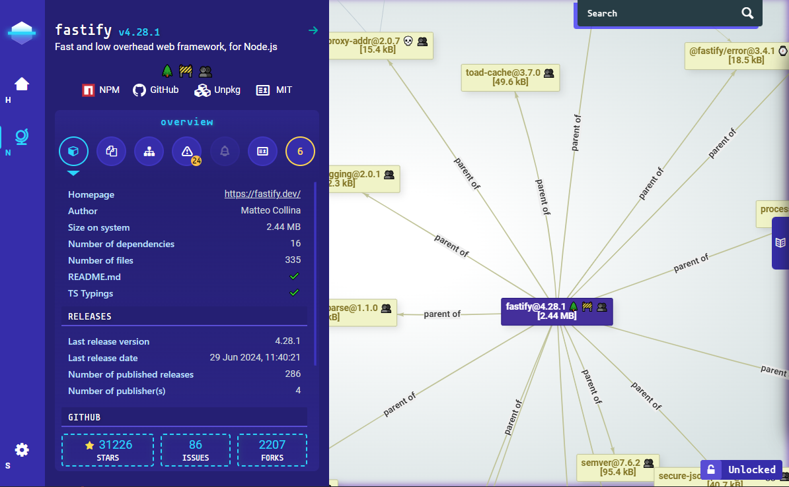

<p align="center">
  
</p>

<p align="center">
  <a href="https://www.npmjs.com/package/@nodesecure/cli">
    
  </a>
  <a href="https://github.com/NodeSecure/cli/blob/master/LICENSE">
    
  </a>
  <a href="https://api.securityscorecards.dev/projects/github.com/NodeSecure/cli">
    
  </a>
  <a href="https://slsa.dev/spec/v1.0/levels#build-l3">
    
  </a>
  <a href="https://github.com/NodeSecure/cli/actions?query=workflow%3A%22Node.js+CI%22">
    
  </a>
  <a href="https://codecov.io/github/NodeSecure/cli">
    
  </a>
</p>

A Node.js tool that performs a static and deep analysis of a package's dependency tree: AST-based scanning for malicious or unsafe patterns, npm registry metadata, license conformance, vulnerability aggregation (GitHub Advisory, Sonatype, Snyk) and [OpenSSF Scorecard](https://github.com/ossf/scorecard), all rendered through an interactive dependency graph.

## 💃 Getting Started

```bash
$ npm install @nodesecure/cli -g
$ nsecure auto express
```

This repository is a monorepo. The `@nodesecure/cli` package, along with its full feature list, command documentation, configuration and FAQ, lives in the [workspaces/cli](./workspaces/cli) workspace — head there for everything about installing and using the CLI.

## 📦 Workspaces

| name | package and link |
| --- | --- |
| cli | [@nodesecure/cli](./workspaces/cli) |
| documentation-ui | [@nodesecure/documentation-ui](./workspaces/documentation-ui) |
| vis-network | [@nodesecure/vis-network](./workspaces/vis-network) |
| size-satisfies | [@nodesecure/size-satisfies](./workspaces/size-satisfies) |
| server | [@nodesecure/server](./workspaces/server) |
| cache | [@nodesecure/cache](./workspaces/cache) |

These packages are available in the Node Package Repository and can be easily installed with [npm](https://docs.npmjs.com/getting-started/what-is-npm) or [yarn](https://yarnpkg.com), for example:

```bash
$ npm i @nodesecure/documentation-ui
# or
$ yarn add @nodesecure/documentation-ui
```

## 🙏 Contributing

If you are a developer **looking to contribute** to the project, please first read our [CONTRIBUTING](./CONTRIBUTING.md) guide (Code of Conduct, first-contributor guide, Developer's Certificate of Origin, Discord).

### Local Setup

```bash
$ git clone https://github.com/NodeSecure/cli.git
$ cd cli

$ npm install
# bundle/compile front-end assets for every workspace
$ npm run build
```

> [!IMPORTANT]
> Restart `npm run build` when modifying files under a workspace's public/front-end assets folder.

Once you have finished your development, check that the tests (and linter) are still good by running the following script:

```bash
$ npm test
```

> [!CAUTION]
> If you add a feature, try adding tests for it along.

### Publishing package and SLSA

The `@nodesecure/cli` package is published on [NPM with provenance](https://docs.npmjs.com/generating-provenance-statements), ensuring that this project is compliant with [SLSA Level 3](https://slsa.dev/spec/v0.1/levels?ref=fossa.com) standards. The build and publication process is managed through the GitHub [npm-provenance.yml](https://github.com/NodeSecure/cli/blob/master/.github/workflows/npm-provenance.yml) workflow, which is automatically triggered upon the creation of a new release.

To create a local version of the package using npm and Git, follow these commands:

```bash
$ npm version [patch | minor | major]
$ git commit -am "chore: x.x.x"
$ git push origin master --tags
```

These commands will increment the package version, commit the changes, and push them along with the tags to the repository.

## Contributors ✨

<!-- ALL-CONTRIBUTORS-BADGE:START - Do not remove or modify this section -->
[](#contributors-)
<!-- ALL-CONTRIBUTORS-BADGE:END -->

Thanks goes to these wonderful people ([emoji key](https://allcontributors.org/docs/en/emoji-key)):

<!-- ALL-CONTRIBUTORS-LIST:START - Do not remove or modify this section -->
<!-- prettier-ignore-start -->
<!-- markdownlint-disable -->
<table>
  <tbody>
    <tr>
      <td align="center" valign="top" width="14.28%"><a href="https://mickaelcroquet.fr"><br /><sub><b>Haze</b></sub></a><br /><a href="https://github.com/NodeSecure/cli/commits?author=CroquetMickael" title="Code">💻</a> <a href="#design-CroquetMickael" title="Design">🎨</a></td>
      <td align="center" valign="top" width="14.28%"><a href="https://www.linkedin.com/in/thomas-gentilhomme/"><br /><sub><b>fraxken</b></sub></a><br /><a href="https://github.com/NodeSecure/cli/commits?author=fraxken" title="Code">💻</a> <a href="https://github.com/NodeSecure/cli/issues?q=author%3Afraxken" title="Bug reports">🐛</a> <a href="#blog-fraxken" title="Blogposts">📝</a> <a href="https://github.com/NodeSecure/cli/commits?author=fraxken" title="Tests">⚠️</a> <a href="https://github.com/NodeSecure/cli/commits?author=fraxken" title="Documentation">📖</a> <a href="#design-fraxken" title="Design">🎨</a></td>
      <td align="center" valign="top" width="14.28%"><a href="https://stouder.io"><br /><sub><b>Xavier Stouder</b></sub></a><br /><a href="https://github.com/NodeSecure/cli/commits?author=Xstoudi" title="Code">💻</a> <a href="#design-Xstoudi" title="Design">🎨</a> <a href="https://github.com/NodeSecure/cli/commits?author=Xstoudi" title="Documentation">📖</a></td>
      <td align="center" valign="top" width="14.28%"><a href="http://tonygo.dev"><br /><sub><b>Tony Gorez</b></sub></a><br /><a href="https://github.com/NodeSecure/cli/commits?author=tony-go" title="Code">💻</a> <a href="https://github.com/NodeSecure/cli/commits?author=tony-go" title="Documentation">📖</a> <a href="https://github.com/NodeSecure/cli/pulls?q=is%3Apr+reviewed-by%3Atony-go" title="Reviewed Pull Requests">👀</a></td>
      <td align="center" valign="top" width="14.28%"><a href="https://github.com/abdellah-housni"><br /><sub><b>abdellah-housni</b></sub></a><br /><a href="https://github.com/NodeSecure/cli/issues?q=author%3Aabdellah-housni" title="Bug reports">🐛</a></td>
      <td align="center" valign="top" width="14.28%"><a href="https://github.com/Kawacrepe"><br /><sub><b>Vincent Dhennin</b></sub></a><br /><a href="https://github.com/NodeSecure/cli/commits?author=Kawacrepe" title="Code">💻</a> <a href="https://github.com/NodeSecure/cli/issues?q=author%3AKawacrepe" title="Bug reports">🐛</a></td>
      <td align="center" valign="top" width="14.28%"><a href="https://github.com/halcin"><br /><sub><b>halcin</b></sub></a><br /><a href="https://github.com/NodeSecure/cli/commits?author=halcin" title="Code">💻</a></td>
    </tr>
    <tr>
      <td align="center" valign="top" width="14.28%"><a href="https://www.linkedin.com/in/ange-tekeu-a155811b4/"><br /><sub><b>Ange TEKEU</b></sub></a><br /><a href="https://github.com/NodeSecure/cli/commits?author=tekeuange23" title="Code">💻</a></td>
      <td align="center" valign="top" width="14.28%"><a href="https://github.com/PierreDemailly"><br /><sub><b>PierreDemailly</b></sub></a><br /><a href="https://github.com/NodeSecure/cli/commits?author=PierreDemailly" title="Code">💻</a></td>
      <td align="center" valign="top" width="14.28%"><a href="https://github.com/Ineslujan"><br /><sub><b>Inès & Mélusine LUJAN-ALVAREZ</b></sub></a><br /><a href="https://github.com/NodeSecure/cli/commits?author=Ineslujan" title="Code">💻</a></td>
      <td align="center" valign="top" width="14.28%"><a href="http://sofiand.github.io/portfolio-client/"><br /><sub><b>Yefis</b></sub></a><br /><a href="https://github.com/NodeSecure/cli/commits?author=SofianD" title="Code">💻</a></td>
      <td align="center" valign="top" width="14.28%"><a href="https://github.com/fabnguess"><br /><sub><b>Kouadio Fabrice Nguessan</b></sub></a><br /><a href="#maintenance-fabnguess" title="Maintenance">🚧</a></td>
      <td align="center" valign="top" width="14.28%"><a href="https://github.com/kishore881"><br /><sub><b>Kishore</b></sub></a><br /><a href="https://github.com/NodeSecure/cli/commits?author=kishore881" title="Code">💻</a></td>
      <td align="center" valign="top" width="14.28%"><a href="https://github.com/FredGuiou"><br /><sub><b>FredGuiou</b></sub></a><br /><a href="https://github.com/NodeSecure/cli/commits?author=FredGuiou" title="Code">💻</a></td>
    </tr>
    <tr>
      <td align="center" valign="top" width="14.28%"><a href="https://github.com/zikos2"><br /><sub><b>ZakariaEttani</b></sub></a><br /><a href="https://github.com/NodeSecure/cli/commits?author=zikos2" title="Code">💻</a></td>
      <td align="center" valign="top" width="14.28%"><a href="http://julienfoucart.fr"><br /><sub><b>Foucart Julien</b></sub></a><br /><a href="https://github.com/NodeSecure/cli/commits?author=foucsi" title="Documentation">📖</a></td>
      <td align="center" valign="top" width="14.28%"><a href="https://github.com/Dafyh"><br /><sub><b>Dafyh</b></sub></a><br /><a href="https://github.com/NodeSecure/cli/commits?author=Dafyh" title="Tests">⚠️</a></td>
      <td align="center" valign="top" width="14.28%"><a href="https://clementgombauld.netlify.app/"><br /><sub><b>Clement Gombauld</b></sub></a><br /><a href="https://github.com/NodeSecure/cli/commits?author=clemgbld" title="Code">💻</a></td>
      <td align="center" valign="top" width="14.28%"><a href="https://www.linkedin.com/in/mark-malaj-99b1b8b7/"><br /><sub><b>Mark MALAJ</b></sub></a><br /><a href="https://github.com/NodeSecure/cli/issues?q=author%3AMarkobobby" title="Bug reports">🐛</a></td>
      <td align="center" valign="top" width="14.28%"><a href="https://github.com/iddahadev"><br /><sub><b>Younes Iddahamou Idrissi</b></sub></a><br /><a href="https://github.com/NodeSecure/cli/commits?author=iddahadev" title="Code">💻</a></td>
      <td align="center" valign="top" width="14.28%"><a href="https://github.com/zeearth"><br /><sub><b>zeearth</b></sub></a><br /><a href="https://github.com/NodeSecure/cli/commits?author=zeearth" title="Code">💻</a></td>
    </tr>
  </tbody>
</table>

<!-- markdownlint-restore -->
<!-- prettier-ignore-end -->

<!-- ALL-CONTRIBUTORS-LIST:END -->

This project follows the [all-contributors](https://github.com/all-contributors/all-contributors) specification. Contributions of any kind welcome!

## License
MIT
