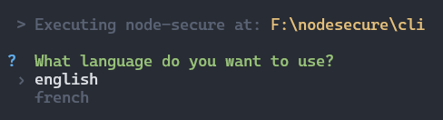

## 📝 Command `lang`

The `lang` command allows you to set your preferred language. Use this command to customize the language used in the CLI or Web interfaces.

<p align="center">

</p>

> [!NOTES]
> Feel free to help us translate this tool into other languages. Translations can be found in the root `./i18n` folder.

## 📜 Syntax

```bash
$ nsecure lang
```
