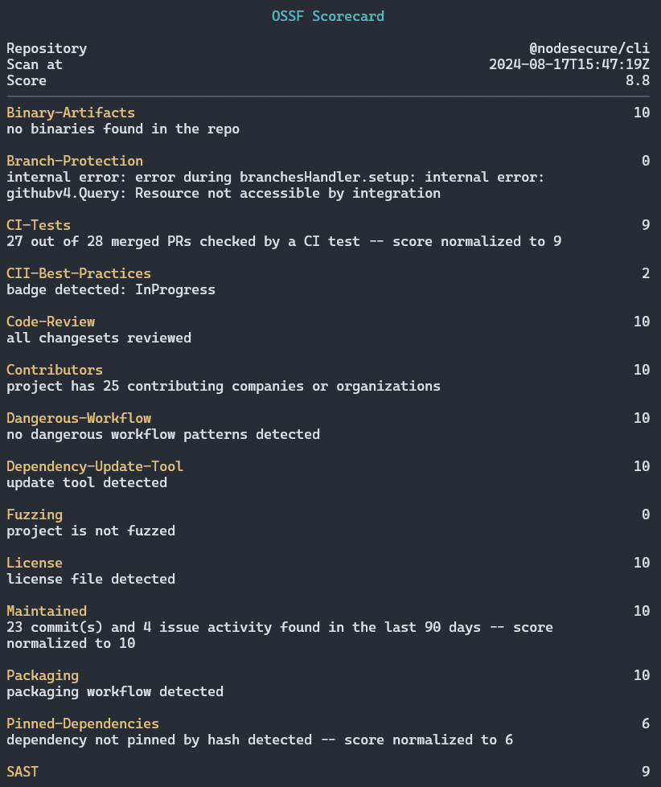

## 📝 Command `scorecard`

The `scorecard` command is used to generate an [OpenSSF scorecard](https://openssf.org/projects/scorecard/) for a specific GIT repository or NPM package.

This command evaluates the repository and provides a security score based on various criteria.

<p align="center">

</p>

Under the hood it use our [OpenSSF scorecard SDK for Node.js](https://github.com/NodeSecure/ossf-scorecard-sdk)

## 📜 Syntax

```bash
$ nsecure scorecard [repository]
```

## ⚙️ Available Options

| Name | Shortcut | Default Value | Description |
|---|---|---|---|
| `--vcs` |   | `github` | Specify the version control system (VCS) used by the repository. |
