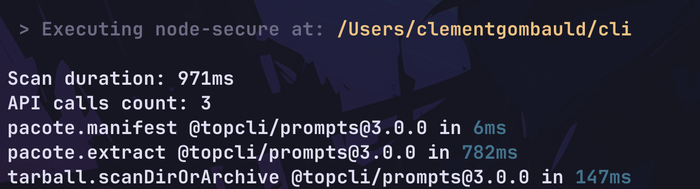

## 📝 Command `stats`

The `stats` displays the statistics of the last performed scan such as :

- The total execution time of the scan
- The total number of API calls made
- every stats about the API calls made
- The total number of errors encountered
- every error encountered

<p align="center">

</p>

## 📜 Syntax

```bash
$ nsecure stats
```

## ⚙️ Available Options

| Name  | Shortcut | Default Value | Description                                              |
| ----- | -------- | ------------- | -------------------------------------------------------- |
| `--min` | `-m`     | `undefined`    | Filter API calls with execution time above ceiling (ms)  |
