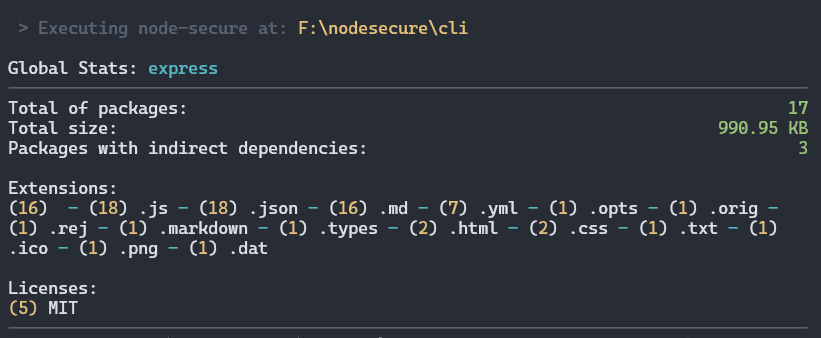

## 📝 Command `summary`

The `summary` command generates a summarized report from a specified JSON payload.

<p align="center">

</p>

## 📜 Syntax

```bash
$ nsecure summary [json]
```

> [!NOTE]
> If the `[json]` property is omitted, the command will default to searching for a `nsecure-result.json` file in the current working directory.
