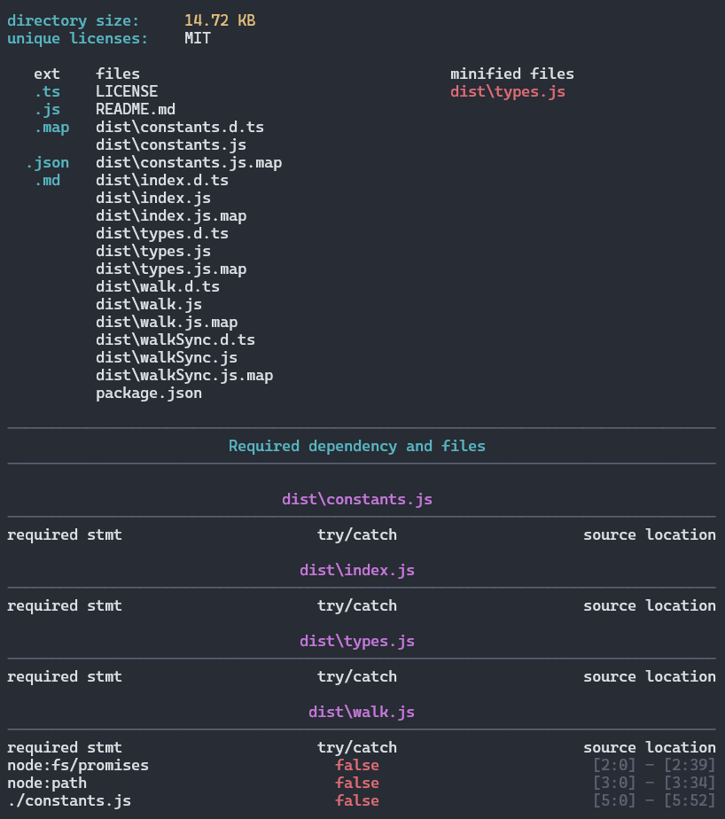

## 📝 Command `verify`

The `verify` command performs a deep analysis of a specified NPM package. It provides advanced information about the files in the tarball, including details on potential threats, file integrity, and more.

<p align="center">

</p>

## 📜 Syntax

```bash
$ nsecure verify [spec]
```

> [!NOTE]
> If the `[spec]` property is omitted, the command will default to searching the local project manifest to extract it's name + version.

## ⚙️ Available Options

| Name | Shortcut | Default Value | Description |
|---|---|---|---|
| `--json` | `-j` | `false` | Output the results in JSON format. |
